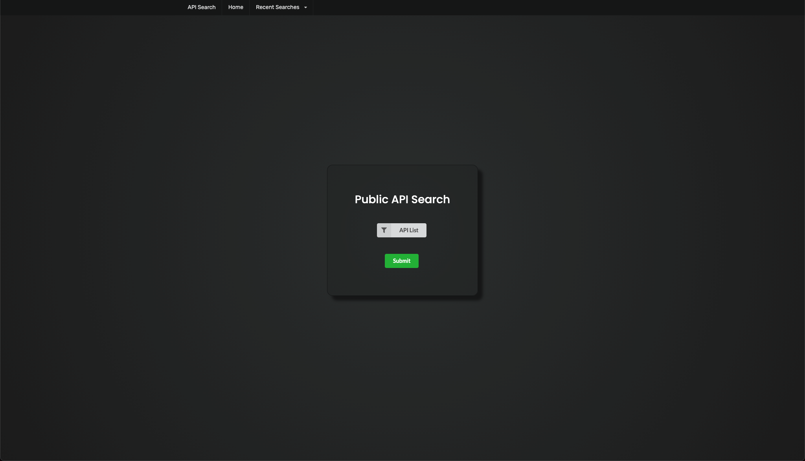
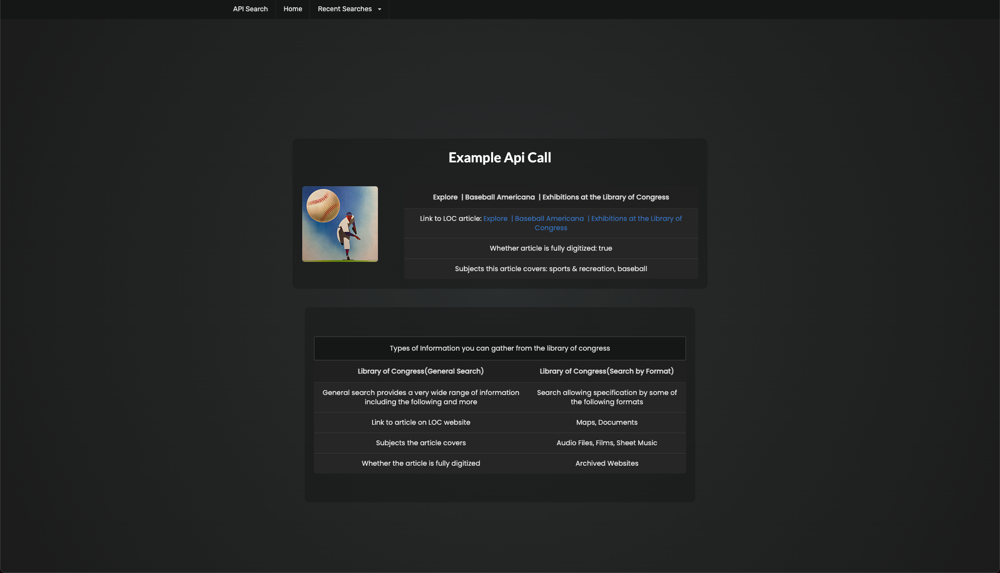
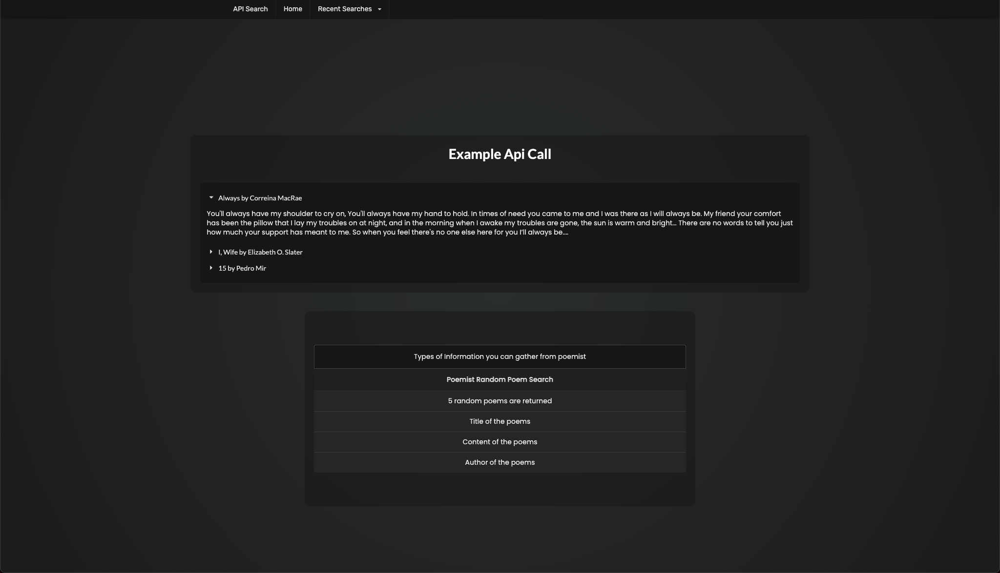

# Public API Search

## Live Site

Link to the live site [here.](https://seanovery.github.io/public-api-search-future/)

---

# Resources used
## Dependencies
* [Semantic UI](https://semantic-ui.com/) 
* [Jquery](https://jquery.com/)
* [Google Fonts](https://fonts.google.com/)
## APIs
* [New York Times Books API](https://developer.nytimes.com/docs/books-product/1/overview)
* [Library of Congress API](https://www.loc.gov/apis/json-and-yaml/)
* [Open Library API](https://openlibrary.org/developers/api)
* [Poemist API](https://poemist.github.io/poemist-apidoc/)
* [Art Institute of Chicago API](https://api.artic.edu/docs/)
* [Metropolitaion Museum of Art API](https://metmuseum.github.io/)
* [Cleveland Museum of Arts API](https://openaccess-api.clevelandart.org/)
* [Hardvard Museum of Art API](https://github.com/harvardartmuseums/api-docs)
* [Foodish API](https://foodish-api.herokuapp.com/)
* [Open Brewery API](https://www.openbrewerydb.org/documentation)
* [Punk API](https://punkapi.com/documentation/v2)
* [Coffee API](https://coffee.alexflipnote.dev/)

---

## Project Description
  This project aims to create a website where developers can filter through a list of apis, select a specific API, and get an example API call as well as a description of major important info you can get from that api. This should help developers more quickly find an API which may suit their needs for a project.

---

## User Story
  AS A web developer  
  I WANT to be able to quickly see useful information I can pull from APIs 
  SO THAT I can more quickly determine if an API will be useful to me for my project

---

## Screenshots
Main page

Results

---

## Collaborators
* [Fahad Islam](https://github.com/sadiyan)
* [Rekha Selvan](https://github.com/rekhaselvan01)
* [Sean O'Very](https://github.com/SeanOVery)

